# 👨‍💻 LeetCode Practice Notes

🔗 **My LeetCode Profile**: [nngiabao1904](https://leetcode.com/u/nngiabao1904/)

---

## 📘 About This Repo

This repository contains my notes, visual explanations, and learnings from solving over **600+ LeetCode problems** ranging from fundamental concepts to advanced algorithms.

Working on LeetCode daily has helped me:
- Sharpen problem-solving skills
- Master core data structures and algorithms
- Improve Java proficiency for backend roles
- Build confidence for technical interviews
  
## 🙌 My thoughts

Solving 600+ problems across **easy and medium difficulty levels** has made me confident in algorithmic thinking, which I apply daily in Java-based backend development.For me, 
understanding **Data Structures and Algorithms (DSA)** is not just about solving coding problems — it has real-world applications and deep practical value in software engineering, especially when building efficient, scalable systems.\
DSA Matters in the Real World(in most of my projects after i have done many questions)
### **1. Performance Optimization**
A bad algorithm can turn a fast app into a slow one.
E.g., searching through millions of records using a linear search (O(n)) vs binary search
Example: In e-commerce apps (like Amazon), searching and filtering products quickly relies on efficient algorithms and data structures (tries, heaps, hash maps, etc.).
### **2. Scalability**
When systems grow (more users, more data), efficiency becomes critical.
Example: Google Maps uses graphs and shortest path algorithms (like Dijkstra's) to compute routes.

## Some DSA that i haved used for my projects

| Project Name     | Function                           | Example Use Case                                               | DSA Applied                                               |
|------------------|------------------------------------|----------------------------------------------------------------|------------------------------------------------------------|
| ShoppingMart     | Online product listing and sales   | User browses products, adds items to cart, and checks out      | Arrays, HashMap (cart), Sorting, Binary Search             |
| ShoppingMart     | Inventory management               | Admin adds stock, views low-inventory warnings                 | HashMap, Priority Queue (for low-stock alerts)             |
| ShoppingMart     | Order tracking                     | User checks order status after placing an order                | Queue (order pipeline), HashMap                            |
| Zalo clone       | Real-time messaging                | Two users exchange messages instantly                          | Queue (message queue), HashMap (user sessions)             |
| Zalo clone       | Typing indicator                   | User sees "User is typing..." while waiting for a reply        | HashMap (user typing states), Timer logic                  |
| Zalo clone       | Message history                    | User scrolls up to view past messages                          | Stack/Deque (for loading messages), Pagination             |
| Facebook clone   | Post sharing                       | User uploads an image with caption for friends to view         | ArrayList, Graph (for feed distribution)                   |
| Facebook clone   | Like and comment system            | Users like and comment on others’ posts                        | HashMap (likes/comments), LinkedList (comment thread)      |
| Facebook clone   | Friend request and follow system   | User sends a friend request or follows another account         | Graph (user connections), BFS/DFS (mutual friends, suggestions) |


# **I'm open to backend internships and entry-level roles. Let’s connect!**
---

## 📊 Progress Overview
**Here is some notes that i have made from practicing**
- 🔄 **LeetCode 1–1000**: (https://www.notion.so/LeetCode-1-1000-221e4689b24a80dabf99eee90ec1adfe?source=copy_link)
- 🔄 **LeetCode 1001–2000**: (https://www.notion.so/LeetCode-1001-2000-21ce4689b24a80d1bf9be444aafe0346?source=copy_link)
- 🔄 **LeetCode 2001–3000+**: (https://www.notion.so/LeetCode-2001-3000-21ce4689b24a80bb848fcb889e89c882?source=copy_link)

- Here i have found resources that DSA interview questions and their solutions:
(https://techiedelight.quora.com/500-Data-Structures-and-Algorithms-interview-questions-and-their-solutions)

---

## 🚀 Algorithm Concepts

### 🔧 Bitwise Operations
- `~` → Bitwise NOT (complement)
- `&` → Bitwise AND
- `^` → Bitwise XOR (used to detect duplicates)

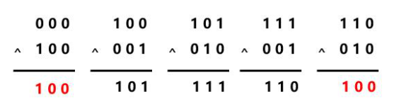

Examples:
- `0^1 = 1` but `0^1^1 = 0`
- `0^1^0^2^1 = 2`

---

### 🔢 Integer Handling in Java
- Be careful of overflow/underflow:
```java
if (rev > Integer.MAX_VALUE/10 || (rev == Integer.MAX_VALUE/10 && pop > 7)) return 0;
```

---

### 🧮 Odd/Even Check via Bitwise
**Use `num & 1` instead of `num % 2`**

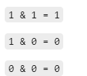
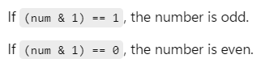
---

### 🗳️ Boyer-Moore Voting Algorithm
**Efficient method to find the majority element in O(n) time and O(1) space.**

**Steps:**
- Track `candidate` and `count`
- Switch candidate when count = 0

---

### 🔁 Circular Array / Modulo Technique
Use modulo or double-size arrays to simulate circular behavior.
- **Modulo technique**
     **New index = (i + k) % total**
e.g: when we want to shift number at index 9 to 3 times when the length of array is 10 => i = 9 , k = 3
=> new index = (9 + 3) % 10 = 2 => that number will be at index 2

---

### ➕ Prefix Sum

---

### 🧱 Monotonic Stack
A monotonic stack is a special kind of stack used to solve problems where you need to find the next or previous greater/smaller element efficiently.
It maintains elements in increasing or decreasing order — that’s why it's called "monotonic".

**Used for problems with “next greater” or “previous smaller” patterns.**

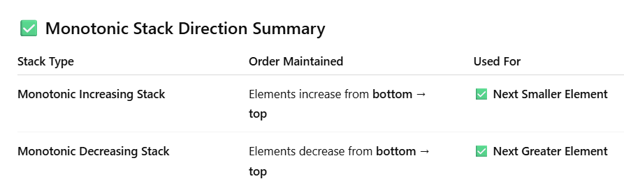

---

### 👫 Two Pointers
**Efficient for sorted arrays or to find subarrays with specific properties.**

---

## 🔤 String Techniques

### ✅ Regex in Java

- Match words only: `[^a-zA-Z]+`
- Match digits:  
  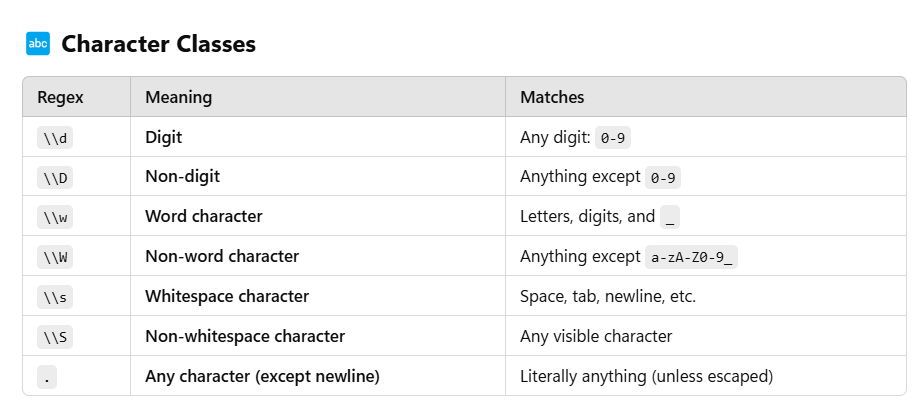

 
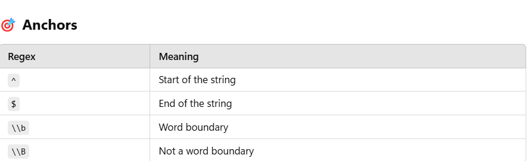

---

### 💥 KMP Algorithm
String pattern search using prefix table.

---

### 🔡 Sorting Characters in a String

1. **Using `Arrays.sort()`**
   
    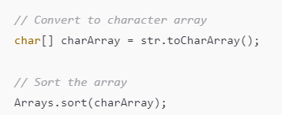
  
3. **Using Stream (Java 8+)**
    Ascending:
    
   
    Descending:  
    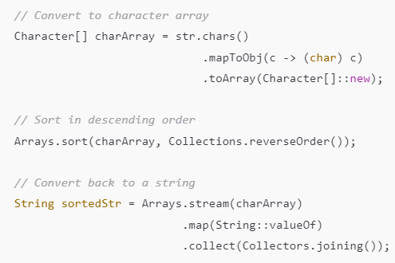

---

## 🧵 Linked List Techniques

### 🧭 Find Middle of Linked List
Use fast and slow pointers — when `fast == null`, `slow` is at the middle.

---

## 🌳 Binary Search Tree (BST)

---

## 🧮 Array Transformations

### Convert 1D ↔ 2D:
```java
// 1D to 2D
row = i / cols;
col = i % cols;

// 2D to 1D
index = row * cols + col;
```
---
## 2D Array (Matrix)

---
## Recursion 
---
## Backtracking
---
## Binary
---
## 💡 Dynamic Programming

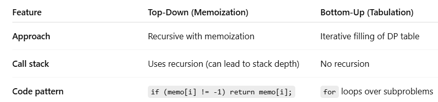

- Top-down (memoization)
- Bottom-up (tabulation)

---

## 🧠 Bit Masking
Use bits to represent subsets. Useful when n ≤ 20.

---

## 🌲 Binary Tree
Use BFS with queue, or DFS with recursion/stack.

---

## 🪟 Sliding Window
The Sliding Window algorithm is a technique used to efficiently solve problems involving contiguous sequences (subarrays or substrings) in arrays or strings. It’s especially useful when you're looking for:

   Maximum/minimum sum of a subarray of size k

   Longest substring with some condition (e.g., without repeating characters)

   Number of substrings that satisfy a condition

---

## 🐢 Tortoise and Hare (Floyd's Cycle Detection)

---

## ⛰️ Heap / Priority Queue

```java
// Min Heap
PriorityQueue<Integer> pq = new PriorityQueue<>();

// Max Heap (2 ways)
PriorityQueue<Integer> pq = new PriorityQueue<>(Collections.reverseOrder());
PriorityQueue<Integer> pq = new PriorityQueue<>((a, b) -> b - a);
```

---

## 🔁 Priority Queue with Custom Comparator

Example using class `Pair`:
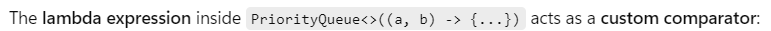

---

📌 ## Queue
A Queue is a linear data structure that follows the FIFO principle:
The first element added is the first one to be removed — like a line at a checkout counter.

### 🔁Real-World Examples
---
## 🔁 DFS
DFS (Depth-First Search) is a fundamental algorithm used to traverse or search through data structures like trees or graphs.
It explores as far as possible along a branch before backtracking.

- Recursive
- Stack-based

---

## Sorting
Java provides multiple ways to sort data, whether it’s numbers, strings, or custom objects

**Some common sorting algorithms:**
### Merge Sort
* Stable: `Yes`
* Time Complexity:
  * Best Case: `O(nlog(n))`
  * Worst Case: `O(nlog(n))`
  * Average Case: `O(nlog(n))`
### Bucket Sort
### Radix Sort
### Quick Sort 
* Stable: `No`
* Time Complexity:
  * Best Case: `O(nlog(n))`
  * Worst Case: `O(n^2)`
  * Average Case: `O(nlog(n))`

### Cyclic Sort (Index-Based)
Cyclic Sort is a very efficient sorting algorithm specifically designed for a special type of problem where:
The elements are in the range [1, N] or [0, N-1]
You need to sort them in O(n) time and O(1) space (in-place)

#### Use Cyclic Sort when the array:
- Contains distinct integers in the range 0 to n-1 or 1 to n
- You want to place each number at its correct index directly


---

## 📐 Math

### 1. Inclusion-Exclusion Principle
The Inclusion-Exclusion Principle is a powerful mathematical concept used in combinatorics to count the number of elements in the union of overlapping sets, avoiding overcounting.
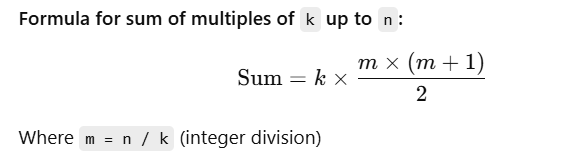

### 2. Catalan Numbers
Catalan numbers form a sequence of natural numbers that appear in a wide variety of combinatorial problems, especially those involving recursive structures.
**Useful in counting valid parenthesis strings, binary trees, etc.**
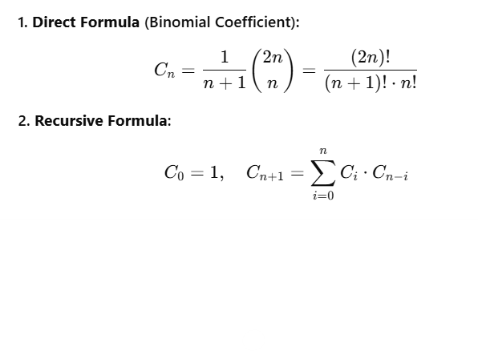

---
### Shoelace's Formula (a.k.a Gauss's Area Formula)
The Shoelace Formula is a method to calculate the area of a polygon when the coordinates of its vertices are known.

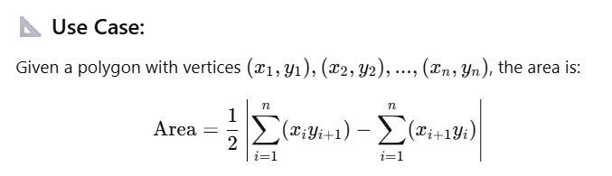
---
## Divide and Conquer


---
## Tries (Prefix tree)
A Trie (pronounced "try") is a tree-like data structure used to store and search strings, especially useful for prefix-based searching.
---
#

---
## Advanced Graphs
---
---
## Here is a list of practice questions for interview from other sources: [Kevin Naughton Jr.](https://github.com/kdn251/interviews)
```
.
├── Array
│   ├── bestTimeToBuyAndSellStock.java
│   ├── findTheCelebrity.java
│   ├── gameOfLife.java
│   ├── increasingTripletSubsequence.java
│   ├── insertInterval.java
│   ├── longestConsecutiveSequence.java
│   ├── maximumProductSubarray.java
│   ├── maximumSubarray.java
│   ├── mergeIntervals.java
│   ├── missingRanges.java
│   ├── productOfArrayExceptSelf.java
│   ├── rotateImage.java
│   ├── searchInRotatedSortedArray.java
│   ├── spiralMatrixII.java
│   ├── subsetsII.java
│   ├── subsets.java
│   ├── summaryRanges.java
│   ├── wiggleSort.java
│   └── wordSearch.java
├── Backtracking
│   ├── androidUnlockPatterns.java
│   ├── generalizedAbbreviation.java
│   └── letterCombinationsOfAPhoneNumber.java
├── BinarySearch
│   ├── closestBinarySearchTreeValue.java
│   ├── firstBadVersion.java
│   ├── guessNumberHigherOrLower.java
│   ├── pow(x,n).java
│   └── sqrt(x).java
├── BitManipulation
│   ├── binaryWatch.java
│   ├── countingBits.java
│   ├── hammingDistance.java
│   ├── maximumProductOfWordLengths.java
│   ├── numberOf1Bits.java
│   ├── sumOfTwoIntegers.java
│   └── utf-8Validation.java
├── BreadthFirstSearch
│   ├── binaryTreeLevelOrderTraversal.java
│   ├── cloneGraph.java
│   ├── pacificAtlanticWaterFlow.java
│   ├── removeInvalidParentheses.java
│   ├── shortestDistanceFromAllBuildings.java
│   ├── symmetricTree.java
│   └── wallsAndGates.java
├── DepthFirstSearch
│   ├── balancedBinaryTree.java
│   ├── battleshipsInABoard.java
│   ├── convertSortedArrayToBinarySearchTree.java
│   ├── maximumDepthOfABinaryTree.java
│   ├── numberOfIslands.java
│   ├── populatingNextRightPointersInEachNode.java
│   └── sameTree.java
├── Design
│   └── zigzagIterator.java
├── DivideAndConquer
│   ├── expressionAddOperators.java
│   └── kthLargestElementInAnArray.java
├── DynamicProgramming
│   ├── bombEnemy.java
│   ├── climbingStairs.java
│   ├── combinationSumIV.java
│   ├── countingBits.java
│   ├── editDistance.java
│   ├── houseRobber.java
│   ├── paintFence.java
│   ├── paintHouseII.java
│   ├── regularExpressionMatching.java
│   ├── sentenceScreenFitting.java
│   ├── uniqueBinarySearchTrees.java
│   └── wordBreak.java
├── HashTable
│   ├── binaryTreeVerticalOrderTraversal.java
│   ├── findTheDifference.java
│   ├── groupAnagrams.java
│   ├── groupShiftedStrings.java
│   ├── islandPerimeter.java
│   ├── loggerRateLimiter.java
│   ├── maximumSizeSubarraySumEqualsK.java
│   ├── minimumWindowSubstring.java
│   ├── sparseMatrixMultiplication.java
│   ├── strobogrammaticNumber.java
│   ├── twoSum.java
│   └── uniqueWordAbbreviation.java
├── LinkedList
│   ├── addTwoNumbers.java
│   ├── deleteNodeInALinkedList.java
│   ├── mergeKSortedLists.java
│   ├── palindromeLinkedList.java
│   ├── plusOneLinkedList.java
│   ├── README.md
│   └── reverseLinkedList.java
├── Queue
│   └── movingAverageFromDataStream.java
├── README.md
├── Sort
│   ├── meetingRoomsII.java
│   └── meetingRooms.java
├── Stack
│   ├── binarySearchTreeIterator.java
│   ├── decodeString.java
│   ├── flattenNestedListIterator.java
│   └── trappingRainWater.java
├── String
│   ├── addBinary.java
│   ├── countAndSay.java
│   ├── decodeWays.java
│   ├── editDistance.java
│   ├── integerToEnglishWords.java
│   ├── longestPalindrome.java
│   ├── longestSubstringWithAtMostKDistinctCharacters.java
│   ├── minimumWindowSubstring.java
│   ├── multiplyString.java
│   ├── oneEditDistance.java
│   ├── palindromePermutation.java
│   ├── README.md
│   ├── reverseVowelsOfAString.java
│   ├── romanToInteger.java
│   ├── validPalindrome.java
│   └── validParentheses.java
├── Tree
│   ├── binaryTreeMaximumPathSum.java
│   ├── binaryTreePaths.java
│   ├── inorderSuccessorInBST.java
│   ├── invertBinaryTree.java
│   ├── lowestCommonAncestorOfABinaryTree.java
│   ├── sumOfLeftLeaves.java
│   └── validateBinarySearchTree.java
├── Trie
│   ├── addAndSearchWordDataStructureDesign.java
│   ├── implementTrie.java
│   └── wordSquares.java
└── TwoPointers
    ├── 3Sum.java
    ├── 3SumSmaller.java
    ├── mergeSortedArray.java
    ├── minimumSizeSubarraySum.java
    ├── moveZeros.java
    ├── removeDuplicatesFromSortedArray.java
    ├── reverseString.java
    └── sortColors.java

```

---
